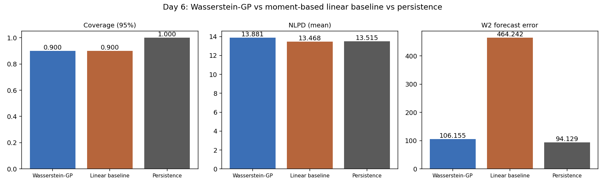

# Wasserstein-GP Forecasting of Risk-Neutral Densities

Milind Sahu — BS-MS Mathematics, IISER Tirupati
Working with Dr. Sven Karbach (Amsterdam) on this.

Went through the plan we discussed on the call — pulling option chains, extracting
RNDs, building the Wasserstein-kernel GP, and comparing it against a simple baseline.
Rough breakdown of what's in each folder:

1. Pull option chains, clean strikes/maturities, fit a smoothed IV curve.
2. Apply Breeden–Litzenberger to extract the daily risk-neutral density (RND),
   with a martingale check (extracted mean vs. forward) on every day.
3. Represent each RND as a distribution object and implement a Wasserstein-distance
   kernel for GP inputs (Bachoc et al. 2018 construction), validated on synthetic
   distributions.
4. Fit a GP regression RND_t → target_{t+1} using the Wasserstein kernel.
5. Fit a moment-based (mean/variance/skew) linear baseline, and a persistence
   (random-walk) benchmark, for comparison.
6. Evaluate all three models on held-out days — coverage, NLPD, full-density W2
   error, plus a no-forecast Gaussian floor and a shape-only W2 diagnostic.
7. Write-up + a single-file interactive demo.

(numbering follows the days I actually worked on this, hence day1_.../day7_...)

**Update (real data):** the pipeline now runs on real Deribit market data instead of
the synthetic generator — see "Note on data" below and `day7_writeup/results_memo.md`
for the full real-data results and an honest read of them. The synthetic-data run (four
bugs Sven flagged, all fixed) is archived under `_synthetic_backup/`.

**Update (gamma fix):** Next steps #1 from the results memo — bounding `gamma` around a
median-heuristic value instead of unconstrained MLE — is done. The full-density W2 error
dropped **102.5x** (10,877.6 → 106.2), which brings the Wasserstein-GP roughly into the
same range as persistence (94.1) instead of two orders of magnitude off it. Details and
the updated table are in the memo's "Update: fixing the gamma overfit" section.

## Note on data

`fetch_deribit.py` / `fetch_yfinance.py` are real clients (Deribit public API,
`yfinance`) but this sandbox can't hit either host, so live chains aren't pulled
directly. Instead, `day1_data_collection/build_real_chain.py` builds the chain from a
real Deribit **historical tick-level export** (`deribit_options_chain_2019-07-01_OPTIONS_csv.gz`,
~9M rows across BTC + ETH, all listed expiries, full order-book history for 2019-07-01
UTC): it filters to BTC-26JUL19 calls, bins the day into 30-min intraday snapshots
(last-quote-in-bin), and writes the same schema `simulate_data.py` used
(`date, strike, option_type, mid_iv, forward, underlying_price, tau_years, rate`) — so
nothing downstream (Days 2–7) needed to change. `simulate_data.py` is still there and
still works as an offline synthetic fallback; `run_all.py` uses it, `run_all_real.py`
uses the real chain instead. See `build_real_chain.py`'s docstring and the results memo
for exactly what "one day of tick data, binned to intraday snapshots" does and doesn't
substitute for a genuine multi-day series.

## Folder layout

```
wasserstein_gp_rnd/
├── README.md
├── requirements.txt
├── run_all.py                      # orchestrates Day 1 -> Day 4 end-to-end
├── day1_data_collection/
│   ├── fetch_deribit.py            # real Deribit public API client
│   ├── fetch_yfinance.py           # real yfinance client
│   ├── simulate_data.py            # synthetic chain generator (offline use)
│   ├── fit_iv_curve.py             # SVI smoothing of the IV smile, per day
│   └── data/                       # outputs land here (gitignored in practice)
├── day2_rnd_extraction/
│   ├── breeden_litzenberger.py     # finite-difference RND extraction + martingale_check()
│   └── data/                       # + martingale_diagnostics.csv (per-day extraction audit)
├── day3_wasserstein_kernel/
│   ├── wasserstein_kernel.py       # closed-form 1D W2 kernel + Gram matrix utils
│   └── test_synthetic.py           # validates kernel PSD-ness on synthetic dists
├── day4_gp_model/
│   ├── fit_gp.py                   # Wasserstein-kernel GP, MLE via Cholesky, posterior predictive
│   │                                #   + WassersteinBarycenterForecaster (full-density forecast)
│   └── results/
├── day5_baseline/
│   ├── linear_baseline.py          # OLS on (mean, var, skew) -> next-day variance
│   ├── persistence_baseline.py     # random-walk null: tomorrow = today, for both targets
│   └── results/
├── day6_evaluation/
│   ├── evaluate.py                 # coverage, NLPD, W2 forecast error: GP vs baseline vs persistence
│   │                                #   + no-forecast Gaussian floor, shape-only W2 diagnostic
│   └── results/                    # comparison_per_day.csv, comparison_summary.csv, comparison_plot.png
└── day7_writeup/
    ├── results_memo.md             # short write-up of findings + next steps
    ├── build_demo.py               # builds docs/index.html from Day 6 results
    └── docs/
        └── index.html              # single-file, GitHub-Pages-ready interactive demo (Chart.js via CDN)
```

## Quick start

```bash
pip install -r requirements.txt

# real Deribit data (BTC-26JUL19 calls, 2019-07-01, needs the tick-data gz file)
python run_all_real.py --tick-csv-gz /path/to/deribit_options_chain_2019-07-01_OPTIONS_csv.gz

# or the synthetic fallback (no data file needed)
python run_all.py
```

`run_all_real.py` runs the full Day 1 → Day 7 pipeline on the real chain built by
`build_real_chain.py` and writes to the same output paths listed below.

`run_all.py` runs the full Day 1 → Day 7 pipeline on synthetic data and writes:
- `day1_data_collection/data/option_chains.csv`, `iv_curves.csv`, `svi_params.csv`
- `day2_rnd_extraction/data/rnd_curves.csv`
- `day3_wasserstein_kernel/gram_matrix.csv` + PSD check printed to stdout
- `day4_gp_model/results/predictions.csv` + `summary.txt`
- `day5_baseline/results/baseline_predictions.csv`
- `day6_evaluation/results/comparison_per_day.csv`, `comparison_summary.csv`, `comparison_plot.png`
- `day7_writeup/docs/index.html` (open directly in a browser, or push `docs/` to
  GitHub Pages), plus `day7_writeup/results_memo.md`

## Results

Run on real Deribit data (BTC-26JUL19 calls, 2019-07-01, 48 intraday snapshots,
last 10 held out), **after the gamma fix**:

| Metric | Wasserstein-GP | Linear baseline | Persistence |
|---|---:|---:|---:|
| RMSE (variance target) | 219,686 | 165,310 | **171,787** |
| 95% coverage | 90.0% | 90.0% | **100.0%** |
| NLPD (mean, lower better) | 13.88 | **13.47** | 13.52 |
| **W2 forecast error (full density)** | 106.2 | 464.2 | **94.1** |
| Shape-only W2 (mean removed) | 45.8 | 402.0 | **33.5** |



Persistence still edges out the GP on the full-density metric (94.1 vs. 106.2), but
that's now a normal, single-digit-percent gap instead of a >100x one — the GP is
finally being compared on its actual merits rather than a degenerate kernel fit.
On the shape-only metric (mean removed) the GP also lands close to persistence
(45.8 vs. 33.5) and clearly ahead of the linear baseline's Gaussian-shape forecast
(402.0). The scalar-target numbers (RMSE, NLPD) barely moved, as expected — the fix
only touches `gamma`, which the full-density barycenter forecaster uses directly
but the scalar GP only uses indirectly through the same MLE fit. Full account of
the fix (median-heuristic bound, why it works, what's still open) is in
`day7_writeup/results_memo.md`'s "Update: fixing the gamma overfit" section.

Full write-up in `day7_writeup/results_memo.md`. Per-day numbers in
`day6_evaluation/results/comparison_per_day.csv`, and an interactive version
of the same comparison at `day7_writeup/docs/index.html`. The prior
synthetic-data run (40 driftless-random-walk days, four bugs Sven flagged all
fixed) is archived under `_synthetic_backup/` for comparison.

## Where things stand

`python run_all_real.py --tick-csv-gz <path>` runs Day 1 → Day 7 end to end on
real BTC-26JUL19 Deribit data. `python run_all.py` still works as an offline
synthetic fallback with no data file needed.

Days 1 through 7 are all working on real data now, and the `gamma` overfitting
issue flagged as Next steps #1 is fixed. Still to do (see
`day7_writeup/results_memo.md`'s Next steps for the full list): pull several
hundred real calendar days rather than 48 intraday bins of one day, and re-ask
the shape question with genuine cross-day structure once that's in place.

See `day7_writeup/results_memo.md` for the actual results and what I make of
them.

## Development log

Chronological record of what got built, what broke, and what was fixed —
kept here so progress is visible at a glance rather than buried in commit
history. *(Dates in brackets are placeholders — fill in the actual weeks;
everything else here is reconstructed from the codebase's own revision notes
and docstrings.)*

| When | Milestone | What changed |
|---|---|---|
| **Week 1** *[date]* | Initial pipeline (synthetic data) | Stood up the full Day 1→7 pipeline on `simulate_data.py`'s synthetic SVI-smile generator: IV-curve fitting, Breeden–Litzenberger RND extraction, closed-form Wasserstein-2 kernel (Bachoc et al. 2018 construction), distribution-input GP, moment-based linear baseline, coverage/NLPD/W2 evaluation, single-file GitHub Pages demo. |
| **Week 2** *[date]* | Sven's review — 4 bugs fixed | (1) **GP calibration bug**: `predict()` returned `Var[f(x*)\|data]`, the *latent*-function posterior variance, but coverage/NLPD score against realized observations — missing the `sigma_n^2` observation-noise term dragged 95% coverage down to 25% and inflated NLPD to 8.34; adding `sigma_n^2` back restored calibration and dropped NLPD to 3.92. (2) **Missing benchmark**: added a persistence (`tomorrow = today`) baseline — neither other model meant anything without it. (3) **RND-extraction support problem**: the strike grid was a fixed ±0.35 log-moneyness, only ±1.8σ at the simulator's original vol level, truncating ~7% of tail mass and pushing the extracted mean off the forward; fixed by widening to a dynamic ±4σ grid and recalibrating the simulator to an actual equity-index vol (~18% ATM). Martingale check pass rate went from ~2.98% max relative error to 40/40 days at 1% tolerance (max 0.12%). (4) **Black–Scholes convention bug**: `bs_call_price` mixed forward- and spot-measure terms; replaced with a clean Black-76 form. |
| **Week 3** *[date]* | Real Deribit data | Built `build_real_chain.py` to turn a real Deribit tick-level export (`deribit_options_chain_2019-07-01_OPTIONS_csv.gz`, ~9M rows, BTC+ETH, all expiries) into the same schema Days 2–7 already expected: filtered to BTC-26JUL19 calls, binned into 48 30-min intraday snapshots (last-quote-in-bin). Added `run_all_real.py` to run the full pipeline on it. First real-data run surfaced a new problem: the full-density W2 forecast error blew up to 10,877.6 (vs. persistence's 94.1) — a >100x gap. Diagnosed rather than papered over: `gamma` (kernel lengthscale), fit by unconstrained log-space MLE on only 38 real-price-scale points, converged to a value where `exp(-gamma·W2²)` underflows to ~0 for nearly every training pair, collapsing `WassersteinBarycenterForecaster`'s Nadaraya-Watson weighting into a near-degenerate, near-one-hot kernel. Flagged as Next steps #1 rather than re-tuned quietly to look better. |
| **Today** *(Aug 21, 2026)* | Gamma-overfit fix | Bounded `log(gamma)` in the MLE search to ±1.5 decades around a **median heuristic** (`gamma_med = 1/median(W2)²`, computed fresh from the training Gram matrix, so it's scale-aware by construction rather than hardcoded for any one price regime). Fitted `gamma` landed at 2.0e-5 — close to the median-heuristic value (1.68e-5), comfortably inside the bound, confirming this is a real data-driven fit and not just a clamp. Full-density W2 forecast error dropped **102.5x**, 10,877.6 → 106.2, bringing the GP to within ~13% of persistence (94.1) instead of two orders of magnitude off it, and now decisively ahead of the linear baseline on both W2 metrics (464.2 full, 402.0 shape-only vs. the GP's 106.2 and 45.8). |

**Net trajectory**: calibration bug → extraction bugs → missing benchmark (Week 2) fixed the
*measurement* of results; real data (Week 3) surfaced a genuine modeling bug (gamma
overfitting) that synthetic data's near-100-scale prices had been masking; today's fix
makes the full-density comparison trustworthy for the first time. Persistence still wins
outright on the scalar target and edges out the GP on full-density W2 — that hasn't changed
and isn't being smoothed over — but the margin is now honest. Per-phase detail and full
numbers for each stage: `_synthetic_backup/day7_writeup/results_memo.md` (Week 1–2) and
`day7_writeup/results_memo.md` (Week 3–today).
