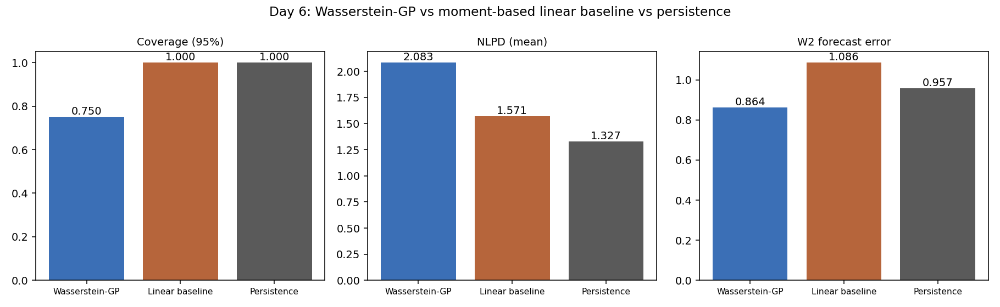

# Wasserstein-GP Forecasting of Risk-Neutral Densities

Milind Sahu — BS-MS Mathematics, IISER Tirupati
Working with Dr. Sven Karbach (Amsterdam) on this.

Went through the plan we discussed on the call — pulling option chains, extracting
RNDs, building the Wasserstein-kernel GP, and comparing it against a simple baseline.
Rough breakdown of what's in each folder:

1. Pull option chains, clean strikes/maturities, fit a smoothed IV curve.
2. Apply Breeden–Litzenberger to extract the daily risk-neutral density (RND),
   with a martingale check (extracted mean vs. forward) on every day.
3. Represent each RND as a distribution object and implement a Wasserstein-distance
   kernel for GP inputs (Bachoc et al. 2018 construction), validated on synthetic
   distributions.
4. Fit a GP regression RND_t → target_{t+1} using the Wasserstein kernel.
5. Fit a moment-based (mean/variance/skew) linear baseline, and a persistence
   (random-walk) benchmark, for comparison.
6. Evaluate all three models on held-out days — coverage, NLPD, full-density W2
   error, plus a no-forecast Gaussian floor and a shape-only W2 diagnostic.
7. Write-up + a single-file interactive demo.

(numbering follows the days I actually worked on this, hence day1_.../day7_...)

**Update (Sven's review):** four issues Sven flagged are fixed as of this revision —
a GP calibration bug (predictive variance was missing the observation-noise term),
a missing persistence benchmark, an RND-extraction support problem (strike grid too
narrow at the old vol level, truncating tail mass), and a Black-Scholes convention
bug. See `day7_writeup/results_memo.md` for the full before/after and what's still
outstanding (real Deribit data).

## Note on data

`fetch_deribit.py` / `fetch_yfinance.py` are real clients (Deribit public API,
`yfinance`) but I couldn't hit either host from where I was running this, so I
haven't pulled live chains yet — that's next on the list once I'm back on a
machine with normal internet.

For now `simulate_data.py` generates a synthetic option-chain series (SVI smile
with a slow day-to-day drift in level/skew/curvature, so it's not just noise)
and that's what feeds Days 2–7 below. Swapping in real chains later shouldn't
touch anything downstream — they just need a CSV of
(date, strike, maturity, mid_iv, forward, rate).

## Folder layout

```
wasserstein_gp_rnd/
├── README.md
├── requirements.txt
├── run_all.py                      # orchestrates Day 1 -> Day 4 end-to-end
├── day1_data_collection/
│   ├── fetch_deribit.py            # real Deribit public API client
│   ├── fetch_yfinance.py           # real yfinance client
│   ├── simulate_data.py            # synthetic chain generator (offline use)
│   ├── fit_iv_curve.py             # SVI smoothing of the IV smile, per day
│   └── data/                       # outputs land here (gitignored in practice)
├── day2_rnd_extraction/
│   ├── breeden_litzenberger.py     # finite-difference RND extraction + martingale_check()
│   └── data/                       # + martingale_diagnostics.csv (per-day extraction audit)
├── day3_wasserstein_kernel/
│   ├── wasserstein_kernel.py       # closed-form 1D W2 kernel + Gram matrix utils
│   └── test_synthetic.py           # validates kernel PSD-ness on synthetic dists
├── day4_gp_model/
│   ├── fit_gp.py                   # Wasserstein-kernel GP, MLE via Cholesky, posterior predictive
│   │                                #   + WassersteinBarycenterForecaster (full-density forecast)
│   └── results/
├── day5_baseline/
│   ├── linear_baseline.py          # OLS on (mean, var, skew) -> next-day variance
│   ├── persistence_baseline.py     # random-walk null: tomorrow = today, for both targets
│   └── results/
├── day6_evaluation/
│   ├── evaluate.py                 # coverage, NLPD, W2 forecast error: GP vs baseline vs persistence
│   │                                #   + no-forecast Gaussian floor, shape-only W2 diagnostic
│   └── results/                    # comparison_per_day.csv, comparison_summary.csv, comparison_plot.png
└── day7_writeup/
    ├── results_memo.md             # short write-up of findings + next steps
    ├── build_demo.py               # builds docs/index.html from Day 6 results
    └── docs/
        └── index.html              # single-file, GitHub-Pages-ready interactive demo (Chart.js via CDN)
```

## Quick start

```bash
pip install -r requirements.txt
python run_all.py
```

This runs the full Day 1 → Day 7 pipeline on synthetic data and writes:
- `day1_data_collection/data/option_chains.csv`, `iv_curves.csv`, `svi_params.csv`
- `day2_rnd_extraction/data/rnd_curves.csv`
- `day3_wasserstein_kernel/gram_matrix.csv` + PSD check printed to stdout
- `day4_gp_model/results/predictions.csv` + `summary.txt`
- `day5_baseline/results/baseline_predictions.csv`
- `day6_evaluation/results/comparison_per_day.csv`, `comparison_summary.csv`, `comparison_plot.png`
- `day7_writeup/docs/index.html` (open directly in a browser, or push `docs/` to
  GitHub Pages), plus `day7_writeup/results_memo.md`

## Results

Run on the synthetic data (40 days, last 8 held out), after Sven's fixes:

| Metric | Wasserstein-GP | Linear baseline | Persistence |
|---|---:|---:|---:|
| RMSE (variance target) | 1.632 | 1.151 | **0.884** |
| 95% coverage | 75.0% | 100.0% | 100.0% |
| NLPD (mean, lower better) | 2.083 | 1.571 | **1.327** |
| **W2 forecast error (full density)** | **0.864** | 1.086 | 0.957 |
| Shape-only W2 (mean removed) | 0.141 | 0.420 | **0.102** |



Persistence — "tomorrow = today, unchanged" — beats both models on the
scalar variance target, and it should: `simulate_data.py`'s SVI parameters
follow a driftless random walk, so day-to-day changes are unpredictable by
construction and the only learnable signal is level persistence. On the
full-density forecast the GP now beats persistence too (0.864 vs. 0.957),
but a Gaussian fit to *today's own* density with zero forecast skill scores
1.083 — nearly identical to the baseline's 1.086 — so most of the
GP-vs-baseline gap is the cost of imposing a Gaussian shape, not forecasting
skill. And the shape-only W2 (each side's mean removed) actually favors
persistence over the GP, so I'm not yet claiming this shows shape-awareness
winning — that needs real data with genuine (non-random-walk) structure to
test properly. Full breakdown, including the GP calibration fix and the RND
extraction fixes, is in `day7_writeup/results_memo.md`.

Full write-up in `day7_writeup/results_memo.md`. Per-day numbers in
`day6_evaluation/results/comparison_per_day.csv`, and an interactive version
of the same comparison at `day7_writeup/docs/index.html`.

## Where things stand

`python run_all.py` runs the whole thing end to end on the synthetic data.
Four things Sven flagged in review are fixed: the GP's predictive variance
now includes the observation-noise term (fixed the 25%-coverage bug), there's
a persistence benchmark everything is checked against, the strike grid is
now wide enough (±4σ, recomputed daily) and the simulator targets an actual
equity-index vol level instead of a crypto-level one, and the Black-Scholes
call price uses a consistent forward-measure convention. RND extraction now
passes a real martingale check (extracted mean vs. forward, 40/40 days at 1%
tolerance) instead of the old "integrates to 1.0" check, which was vacuous
by construction.

Days 1 through 7 are all working. Still to do: real Deribit/yfinance data
instead of the synthetic generator (I don't have network access to
deribit.com from where I'm running this right now), a longer training
window, and re-asking the shape question in a metric that can actually see
shape once real data is in.

See `day7_writeup/results_memo.md` for the actual results and what I make of
them.
